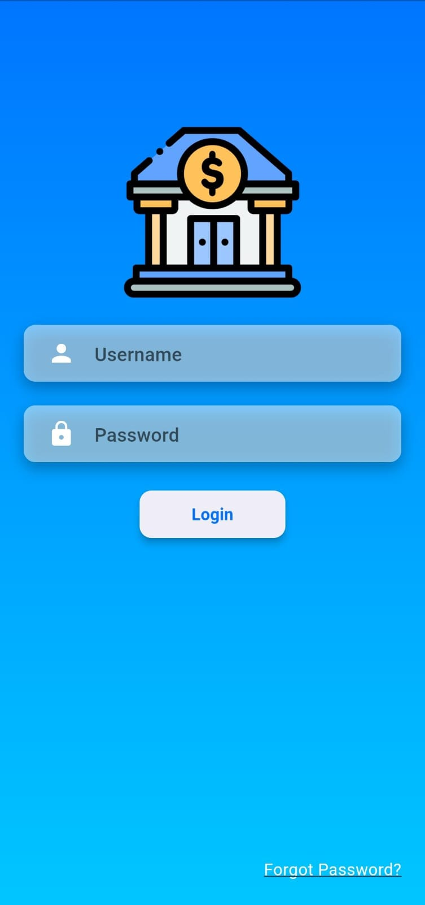
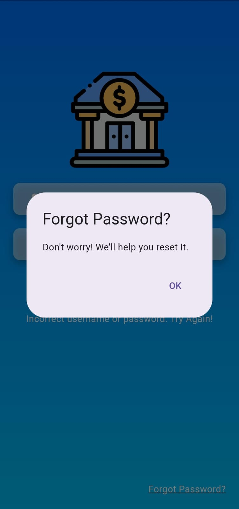
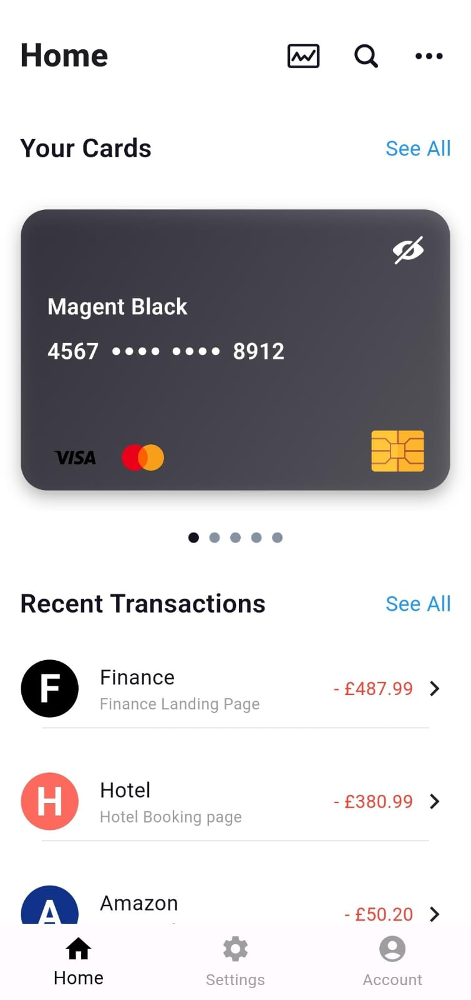
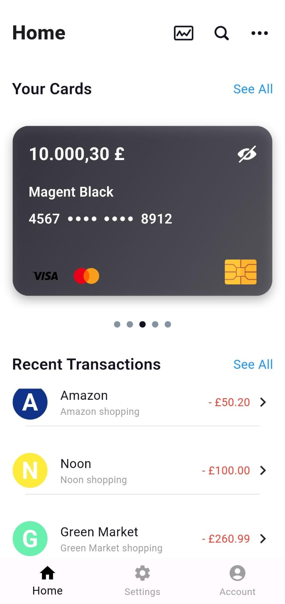
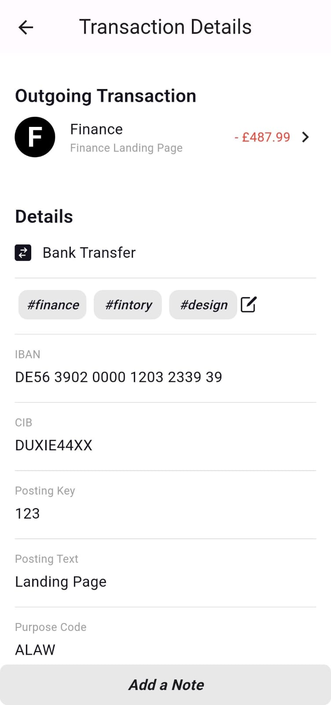
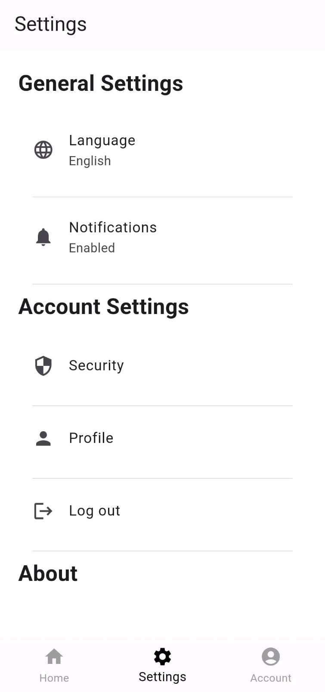

# Banking App (Flutter)

A cross-platform mobile banking app UI built with Flutter, featuring a login screen, home dashboard with credit card display, and transaction history.

## Screenshots

<table>
  <tr>
    <td align="center">
      <br/>
      <sub><b>Login</b></sub>
    </td>
    <td align="center">
      <br/>
      <sub><b>Forgot Password</b></sub>
    </td>
    <td align="center">
      <br/>
      <sub><b>Home</b></sub>
    </td>
  </tr>
  <tr>
    <td align="center">
      <br/>
      <sub><b>Home (scrolled)</b></sub>
    </td>
    <td align="center">
      <br/>
      <sub><b>Transaction Details</b></sub>
    </td>
    <td align="center">
      <br/>
      <sub><b>Settings</b></sub>
    </td>
  </tr>
  <tr>
    <td align="center" colspan="3">
      <br/>
      <sub><b>App Icon</b></sub>
    </td>
  </tr>
</table>

## Features
- **Login screen** with gradient background and credential validation
- **Home dashboard** combining an app bar, a scrollable list of bank cards, and recent transactions
- **Credit card widget** with a show/hide toggle for the balance (privacy mode)
- **Transaction history** with individual transaction cards
- **Account & Settings screens** for managing user details
- **Add Note** widget for annotating transactions

## Project Structure
```
lib/
├── main.dart                  # App entry point
├── home_widget.dart            # Root widget after login
├── screens/                    # Login, Home, Account, Transactions, Settings
├── widgets/                    # CreditCard, TransactionCard, AddNote, CardInPage
├── components/                 # Appbar, CardsList, RecentTransactions
└── utilities/                  # Theme colors & text styles

screenshots/                    # App screenshots used in this README
```

## Tech Stack
- Flutter / Dart
- `flutter_svg` (SVG icon rendering)
- Material Design

## How to Run
1. Install [Flutter SDK](https://docs.flutter.dev/get-started/install)
2. Open `lib/screens/loginPage.dart` and set your own `validUsername` / `validPassword` values
3. Run:
```bash
flutter pub get
flutter run
```

## Security Note
Login credentials are defined as constants in `loginPage.dart` and are redacted in this repository. This is a UI/demo project — a real app should authenticate against a backend, not hardcoded values.

## Note
This is a **UI/frontend prototype** — it demonstrates app design and Flutter widget composition. It does not connect to a real backend or bank data; all displayed transactions and balances are static/demo data.
